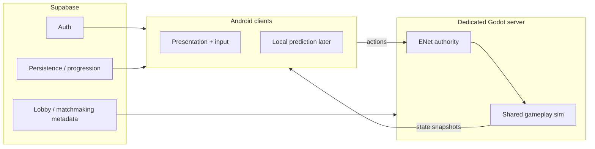

# GUTTERUMBLE — Canonical Architecture (Frozen)

**Status:** FREEZE (Command 01 / Phase 0)  
**Date:** 2026-08-13  
**Scope:** Forensic ground truth only — no gameplay code changes in this command.  
**Do NOT start by wiring `networked_player.gd` into the arena.**

This document freezes **THE** canonical path per category. Duplicate / orphan systems are classified in the table below. Agents must treat this file as the source of truth until a later command explicitly revises it.

---

## Canonical implementations (file + symbol)

### PLAYER

| Role | Canonical path | Symbol / note |
|------|----------------|---------------|
| Scene (live arena) | `scenes/player/sprite_fighter.tscn` | 2.5D lane + true 2D `AnimatedSprite3D`; spawned by arenas / pool |
| Script / FSM | `scenes/player/player_controller.gd` | Combat + lane locomotion FSM (shared with legacy skeletal path) |
| Visual | `scenes/player/sprite_visual.gd` + `assets/characters/sprite_fighter/` | Sheet + `fighter_anim_meta.json` |
| Legacy skeletal | `scenes/player/fighter.tscn` + `mouse.glb` | Kept for reference; **not** arena-spawned |
| **Not canonical** | `scenes/player/networked_player.gd` | Obsolete parallel player path (RPCs stubbed) |
| **Not canonical** | `scenes/player/player.tscn` | Wraps `networked_player.gd` — do not spawn in arenas |

See also: [`SPRITE_FIGHTER_25D.md`](./SPRITE_FIGHTER_25D.md).

### COMBAT

| Role | Canonical path | Symbol / note |
|------|----------------|---------------|
| Attack data + enums | `scenes/player/attack_config.gd` (autoload `AttackConfig`) | Frame data; `CombatState` / `AttackPhase` |
| Attack execution | `scenes/player/player_controller.gd` | Attack FSM (windup → active → recovery); mirrors on `enemy_ai.gd` |
| Hitbox | `scenes/combat/hitbox.gd` | `class_name Hitbox` — `begin_swing` / `hit_landed` |
| Hurtbox | `scenes/combat/hurtbox.gd` | `class_name Hurtbox` — group / script marker |
| **Damage path** | Hitbox → listener → `target.take_damage(...)` | **NOT** `CombatManager.apply_damage` |
| Special | `autoloads/special_meter.gd` (`SpecialMeter`) + `PlayerController._do_special_aoe` | Gauge + Musou AOE |
| CombatManager | `scenes/combat/combat_manager.gd` (autoload) | **NOT authoritative** — stub / legacy distance helper |

Verified: `Hitbox` emits `hit_landed`; controllers call `take_damage` on the target node. `CombatManager.apply_damage` is a no-op stub.

### MATCH

| Role | Canonical path | Symbol / note |
|------|----------------|---------------|
| Round / match flow | `autoloads/round_manager.gd` | Autoload `RoundManager` — used by `rumble_arena_back_alley.gd` |
| Waves | `autoloads/gang_spawner.gd` | Autoload `GangSpawner` |
| MatchResolver | `systems/match_resolver.gd` | **Test-only** today (`scenes/test/test_match_resolver.*`) |

**Freeze decision:**

- **KEEP** `RoundManager` as canonical match-flow for now.
- **DEFER** `MatchResolver` integration until compared against live arena flow.
- **Do not wire both** into the arena at the same time.

### NETWORK

| Role | Decision |
|------|----------|
| Future realtime gameplay | **ENet + dedicated Godot server** — rebuild `backend/match_server.gd` around a **shared sim** |
| Supabase | Auth, lobby metadata, persistence, progression — **NOT combat sync** |
| `NetRealtimeSync` (`net/realtime_sync.gd`) | Obsolete as combat sync — **isolate / DEFER removal** |
| `networked_player` RPCs | Obsolete player path — quarantine; do not extend |

### BACKEND

| Role | Canonical rule |
|------|----------------|
| SQL source of truth | `backend/supabase_schema.sql` — normalize GDScript / edge code toward it |
| Lobby shape | `host_id` + `status` ∈ `open \| starting \| closed` — **SQL wins** over `LobbyManager` GDScript field names (`host_user_id`, `WAITING`, etc.) |
| Appearance | JSONB **OBJECT** matching `CustomizationManager.current_appearance` `Dictionary` — schema default `'[]'::jsonb` must be normalized |
| Matchmaking | Create `matchmaking_queue` table — **not** a phantom `/matchmaking` REST route |
| Rewards | Single **service_role** path (edge or SQL `award_match_rep`) — **not** client-callable with anon |

---

## Target architecture

### Layering (ASCII)

```
┌─────────────────────────────────────────────────────────────┐
│                  SHARED GAMEPLAY SIM                        │
│  PlayerController FSM · AttackConfig · Hitbox/Hurtbox       │
│  RoundManager · GangSpawner · SpecialMeter · FighterPool    │
└──────────────────────────┬──────────────────────────────────┘
                           │
           ┌───────────────┴───────────────┐
           ▼                               ▼
   ┌───────────────┐               ┌───────────────┐
   │ OFFLINE HOST  │               │ DEDICATED     │
   │ (Android /    │               │ GODOT SERVER  │
   │  editor)      │               │ (ENet)        │
   │ same sim      │               │ same sim      │
   └───────┬───────┘               └───────┬───────┘
           │                               │
           └───────────────┬───────────────┘
                           ▼
           ┌───────────────────────────────┐
           │ PRESENTATION / NETWORK EDGE   │
           │ HUD · VFX · interpolators     │
           │ input capture · RPCs (later)  │
           └───────────────────────────────┘
```

### Online stack (mermaid)



**Rule of thumb:** Supabase never owns hit registration, health, or round winners. The shared sim does — offline alone, or on the Godot server online.

---

## Classification table (duplicates / orphans)

Legend: **KEEP** | **MERGE** | **REPLACE** | **DELETE** | **DEFER**

| System | Path | Verdict | Rationale |
|--------|------|---------|-----------|
| PlayerController | `scenes/player/player_controller.gd` | **KEEP** | Canonical human FSM; arena truth |
| networked_player | `scenes/player/networked_player.gd` | **DEFER** → eventual **DELETE** | Obsolete parallel path; quarantine first (Command 02) — do not wire into arena |
| fighter.tscn | `scenes/player/fighter.tscn` | **KEEP** | Canonical spawn scene (Hitbox/Hurtbox + controller) |
| player.tscn | `scenes/player/player.tscn` | **DEFER** → eventual **DELETE** | Capsule + networked_player only; not used by arenas |
| Hitbox | `scenes/combat/hitbox.gd` | **KEEP** | Canonical swing / dedup component |
| Hurtbox | `scenes/combat/hurtbox.gd` | **KEEP** | Canonical hurt marker |
| CombatManager | `scenes/combat/combat_manager.gd` | **REPLACE** (mark obsolete) → later **DELETE** | Not on damage path; stub `apply_damage`; annotate in Command 02 |
| AttackConfig | `scenes/player/attack_config.gd` | **KEEP** | Single frame-data source |
| RoundManager | `autoloads/round_manager.gd` | **KEEP** | Canonical match-flow for arenas |
| MatchResolver | `systems/match_resolver.gd` | **DEFER** | Test-only; evaluate before integrate; do not dual-wire with RoundManager |
| MatchStart | `net/match_start.gd` | **DEFER** | Useful for future net countdown; keep tests; not wired to offline arena |
| GangSpawner | `autoloads/gang_spawner.gd` | **KEEP** | Canonical wave / team spawn |
| FighterPool | `autoloads/fighter_pool.gd` | **KEEP** | Canonical pool for fighter scenes |
| CombatFeel | `autoloads/combat_feel.gd` | **KEEP** | Hit-stop / camera / juice — presentation adjacent to sim |
| SpecialMeter | `autoloads/special_meter.gd` | **KEEP** | Canonical special gauge |
| NetworkManager | `autoloads/network_manager.gd` | **MERGE** (later) | Thin facade today; will route to lobby + dedicated server, not combat sync |
| LobbyManager | `net/lobby_manager.gd` | **REPLACE** fields toward SQL | Keep module; normalize to `host_id` + `open\|starting\|closed` |
| NetRealtimeSync | `net/realtime_sync.gd` | **DEFER** → eventual **DELETE** | Obsolete as combat sync; isolate claims in Command 02 |
| RemotePlayerInterpolator | `net/remote_player_interpolator.gd` | **DEFER** | Revisit only with ENet snapshots — not Supabase Broadcast combat |
| NetConnectionLifecycle | `net/connection_lifecycle.gd` | **DEFER** | Tied to Realtime resume; rework with dedicated server lifecycle |
| match_server.gd | `backend/match_server.gd` | **REPLACE** | Skeleton ENet host — rebuild around shared sim (Command 05+) |
| SupabaseManager | `backend/supabase_manager.gd` | **KEEP** | Auth / REST / local fallback entry |
| LocalProfileStore | `backend/local_profile_store.gd` | **KEEP** | Offline persistence when Supabase unset |
| RepPipeline | `systems/rep_pipeline.gd` | **MERGE** toward service_role | Client must not award with anon; align with `award_match_rep` |
| fighter_lod | `scenes/player/fighter_lod.gd` | **DEFER** | Exists, unwired; blocked on mesh variants |
| material_manager | `scenes/arenas/back_alley/material_manager.gd` | **DEFER** | Present but unwired; wire or archive later — do not invent a second material path |
| pause_menu | `scenes/ui/pause_menu.gd` + `.tscn` | **KEEP** | Wired by arena |
| AnimationTreeBuilder | `autoloads/animation_tree_builder.gd` | **KEEP** | Builds fighter AnimationTree at runtime |
| VFXPool | `autoloads/vfx_pool.gd` | **KEEP** | Hit sparks / trails pool |
| weapon_manifest | `docs/weapon_manifest.json` | **DEFER** (data only) | **No code** yet — content contract for Command 07; do not invent parallel weapon systems |

---

## CRITICAL RULES (1–15)

1. **One player path:** `fighter.tscn` + `PlayerController` only in live arenas.
2. **Never wire `networked_player.gd` / `player.tscn` into the arena** as a shortcut to multiplayer.
3. **Damage is `Hitbox` → `take_damage`.** Do not route damage through `CombatManager.apply_damage`.
4. **`AttackConfig` is the only frame-data source** for light/heavy/dodge/special timings and numbers.
5. **`Hitbox` / `Hurtbox` class_names are the only hit registration components** for fighters.
6. **Specials go through `SpecialMeter` + `_do_special_aoe`** (or the shared-sim equivalent later) — no parallel special systems.
7. **`RoundManager` owns offline match-flow today.** Do not also drive the arena from `MatchResolver`.
8. **`MatchResolver` stays test-only** until an explicit compare-and-integrate command.
9. **`GangSpawner` owns wave spawning**; do not fork a second wave director.
10. **Future combat net = ENet + dedicated Godot server + shared sim** — not Supabase Realtime Broadcast for hits/health.
11. **Supabase is auth, lobby metadata, persistence, progression only.**
12. **Treat `NetRealtimeSync` as non-combat**; isolate and defer removal — do not extend it for combat.
13. **`backend/supabase_schema.sql` is canonical SQL**; GDScript lobby/appearance fields normalize toward it.
14. **Lobby truth = `host_id` + `status open|starting|closed`.** SQL wins over `LobbyManager` enum/field drift.
15. **Rewards only via service_role** (edge/SQL). Matchmaking uses a real `matchmaking_queue` table — no phantom `/matchmaking` REST, no anon-callable rep awards. Appearance column is a JSONB **object**.

---

## Explicit non-goals of this freeze

- Implementing multiplayer features
- Deleting quarantined files (search + annotate first — Command 02)
- Dual-running RoundManager and MatchResolver
- Treating docs claims in older roadmaps (`PROJECT_BLUEPRINT.md` Phase 1 Supabase Broadcast combat) as overriding this freeze

**Next:** [`ARCHITECTURE_MIGRATION_PLAN.md`](./ARCHITECTURE_MIGRATION_PLAN.md)
