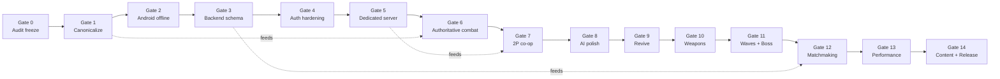

# GUTTERUMBLE — Implementation Dependency Graph

**Companion to:** [`REPOSITORY_AUDIT.md`](./REPOSITORY_AUDIT.md) (AUTHORITATIVE)  
**Critical path (revised):**  
canonicalize → Android offline → backend schema → dedicated server → authoritative combat → 2-player co-op → AI / revive / weapons → waves / boss → matchmaking → performance → content → release

This document states **which systems must complete before others**, with an explicit **why** on every edge. Gates 0–14 are the execution contract for Commands 01–16.

---

## Mermaid — critical path & gates

Solid edges are hard blockers. Dotted edges call out long-range dependencies that still must not be violated even if parallel work is tempted.

---

## Gates 0–14

### Gate 0 — Architecture audit freeze

**Done when:** `docs/engineering/REPOSITORY_AUDIT.md` and this graph exist; live path citations match source.

**Unlocks:** Gate 1.

**Why before everything:** Without a frozen map of live vs orphan symbols (`rumble_arena_back_alley.gd`, `CombatManager.apply_damage`, `player.tscn`, dual net stacks), later commands reintroduce drift and wire the wrong stack.

---

### Gate 1 — Canonicalize live combat path

**Scope:** Single source of truth = arena + `fighter.tscn`/`player_controller.gd` + `mouse_enemy.tscn`/`enemy_ai.gd` + `Hitbox`/`Hurtbox` + `AttackConfig` + `RoundManager`/`GangSpawner`/`CombatFeel`/`SpecialMeter`/`FighterPool`. Mark or quarantine orphans (`CombatManager.apply_damage` stub, `networked_player` unused scene, unwired LOD/materials, test-only `MatchResolver`/`RepPipeline`/`MatchStart`).

**Depends on:** Gate 0.

**Unlocks:** Gate 2 (Android must target the real loop), Gate 6 (authority builds on the canonical damage API).

**Why:** Android controls and net authority must attach to the path players already fight on. Wiring touch or RPCs to `player.tscn`/`CombatManager` would automate a dead tree.

---

### Gate 2 — Android offline playable

**Scope:** `export_presets.cfg`; touch / virtual controls mapped into the same actions as `project.godot` `[input]`; wire `pause_menu.tscn` `ResumeButton`/`QuitButton` to `pause_menu.gd` `_on_resume`/`_on_quit`; landscape mobile package boots main menu → arena.

**Depends on:** Gate 1.

**Unlocks:** Gate 3 (backend work assumes a shippable client shell); Gate 14 eventually needs export.

**Why before backend/net:** Offline APK proves the product loop without auth, lobbies, or servers. Schema/net changes that break local fallback would be invisible without a device loop. Pause/touch fixes are prerequisites for any storeable build (`docs/compliance/ANDROID_EXPORT.md` cannot substitute for missing presets).

---

### Gate 3 — Backend schema contract

**Scope:** Align `LobbyManager` fields with `backend/supabase_schema.sql` (`host_id`, `status`, `lobby_members` vs `host_user_id`/`player_ids`/`WAITING`); unify appearance Dictionary vs Array vs `JSONB`; collapse dual `award_match_rep` (`supabase_schema.sql` + `edge_functions/award_match_rep.sql`); remove or replace phantom `SupabaseManager.queue_for_match` → `/rest/v1/matchmaking`; decide live write path (`log_match` vs `RepPipeline`).

**Depends on:** Gate 2 (client exists to exercise local fallback + remote flags).

**Unlocks:** Gate 4, Gate 12.

**Why before dedicated server / matchmaking:** Server allocation and lobby join against the wrong column names will fail closed or corrupt rows. Matchmaking cannot be “real” until the lobby/match tables the client writes actually exist and match.

---

### Gate 4 — Auth hardening

**Scope:** Add Supabase `apikey` (and bearer where required) to `NetworkManager.sign_in`/`sign_up`; keep **no** `service_role` in client; ensure anon policies match schema RLS.

**Depends on:** Gate 3 (know which tables/RPCs auth must reach).

**Unlocks:** Gate 5 (server may trust identity), Gate 12.

**Why:** `find_rumble_match` already requires `NetworkManager.is_authenticated`. Without working auth headers, every authenticated lobby path is fake-local-only. Identity must be real before a dedicated server attributes peers to accounts.

---

### Gate 5 — Dedicated match server

**Scope:** Flesh out `backend/match_server.gd`: real tick, player registry, `broadcast_state` with non-empty `_on_receive_state`, lifecycle under `OS.has_feature("server")`; `NetworkManager.connect_to_match` reaches it.

**Depends on:** Gate 4 (identity), Gate 3 (match row shape for allocation metadata).

**Unlocks:** Gate 6, Gate 7.

**Why before authoritative combat / co-op:** Host-as-player authority recreates the current local cheat surface. Co-op needs a place that owns the clock (`MatchStart`-style fight start) before two clients share a world.

---

### Gate 6 — Authoritative combat

**Scope:** Replace stubs `CombatManager.apply_damage`, `networked_player._rpc_attack_light`; ban trust of raw `@rpc("any_peer")` attack success; server validates hit windows using `AttackConfig` data; clients predict, server confirms.

**Depends on:** Gate 1 (canonical damage API), Gate 5 (server tick to validate on).

**Unlocks:** Gate 7, Gates 8–10 (gameplay systems that deal damage must go through the same authority channel).

**Why before co-op features:** Two players exchanging unverified `_rpc_attack_light` / `player_attack` calls invent desync and cheating. AI/revive/weapons added atop client-authoritative hits hard-wire unfair netcode.

---

### Gate 7 — 2-player co-op

**Scope:** Wire `networked_player.gd` (or merge into `player_controller.gd` authority model), attach `RemotePlayerInterpolator`, drive `MatchStart` countdown from server, spawn second human in `rumble_arena_back_alley.gd` when a peer is present.

**Depends on:** Gate 5, Gate 6.

**Unlocks:** Gate 8+ (co-op content), Gate 12 (matchmaking targets a working 2P session).

**Why:** Matchmaking into a solo AI arena wastes the queue. Interpolation and countdown only matter once two peers share authoritative combat.

---

### Gate 8 — AI polish (shared combat API)

**Scope:** Keep `enemy_ai.gd` public API aligned with player (`take_damage`, `is_dead`, `reset_for_respawn`); difficulty / telegraph / teamwork improvements that still call the Gate 6 damage path.

**Depends on:** Gate 6 (and Gate 7 if AI must respect remote players as targets).

**Unlocks:** Gate 9, Gate 11.

**Why before revive/weapons/waves:** Revive and weapons change damage/death contracts; waves multiply AI instances. Stabilizing the AI ↔ authority interface first prevents N copies of broken assumptions in `GangSpawner`.

---

### Gate 9 — Revive

**Scope:** Define revive rules (who can revive, window, authority), HUD, and round interaction with `RoundManager` / Warriors wipes.

**Depends on:** Gate 8 (death/KO API stable), Gate 7 if revive is co-op assist.

**Unlocks:** Gate 10, Gate 11.

**Why before weapons/bosses:** Weapons and bosses change KO frequency and lethality. Revive layered afterward becomes a rewrite; revive first establishes life-cycle invariants both modes share.

---

### Gate 10 — Weapons

**Scope:** Promote `docs/weapon_manifest.json` into runtime equip; extend `AttackConfig` (or weapon-specific tables); animate/VFX via existing trail systems; authority-aware damage tags.

**Depends on:** Gate 9 (life-cycle settled), Gate 6 (damage authority).

**Unlocks:** Gate 11.

**Why before waves/boss:** Boss and wave tuning depends on player threat model. Adding weapons after boss balancing doubles combat pass cost. Authority must already treat weapon ids as server-checked attack ids.

---

### Gate 11 — Waves + boss

**Scope:** Expand `GangSpawner` wave tables; boss encounter scene(s); ensure pools (`FighterPool`) absorb spike spawns; optional `MatchResolver` integration for elimination/timer modes if multiplayer modes need deterministic end.

**Depends on:** Gate 8–10.

**Unlocks:** Gate 12 (modes to advertise), Gate 13 (load to profile).

**Why before matchmaking / performance:** Queue needs a mode catalog; performance work needs representative spawn stress. Matchmaking into empty mode shells creates support debt.

---

### Gate 12 — Matchmaking

**Scope:** Replace phantom `/matchmaking` with schema-backed queue or lobby search; `NetworkManager.find_rumble_match` → `LobbyManager` → allocate dedicated server → co-op arena boot; local fallback remains for offline.

**Depends on:** Gates 3–4 (schema + auth), Gate 5 (server to hand out), Gate 7 (session that can host two players), Gate 11 (modes worth queuing).

**Unlocks:** Gate 13 (online perf), Gate 14 (online release claims).

**Why so late:** Early matchmaking against stubs (`queue_for_match`, field drift) trains broken clients. Only after schema, auth, server, co-op, and modes exist does a queue create real matches.

---

### Gate 13 — Performance

**Scope:** Wire `fighter_lod.gd` once meshes exist; validate pools under boss/wave load; `PerfLogger` budgets on Pixel-class hardware; shader warmup coverage for new weapons/boss materials; respect `max_lights_per_object=2`.

**Depends on:** Gate 11 (content stress), Gate 12 if online tick budgets matter.

**Unlocks:** Gate 14.

**Why before release content flood:** Optimizing after all arenas/weapons land causes thrash. Optimizing before waves/boss yields fake green metrics. Content polish (Gate 14) may add assets but must not invent new unpooled spawn paths.

---

### Gate 14 — Content + release

**Scope:** Retarget combat animations; additional arenas; audio/provenance (`CREDITS.md`); store compliance (`docs/compliance/*`); closed test → public; CI still `.github/workflows/godot-ci.yml` plus any new headless scenes for gates above.

**Depends on:** Gate 13 (perf floor), Gate 12 if online is in the release claim, Gate 2 (export path).

**Unlocks:** Public release.

**Why last:** Store listing and hours-of-content promises are lies until offline Android, online contracts (if claimed), and frame budget are real. Content expands a finished pipeline; it must not redefine architecture.

---

## Edge catalog (why each arrow exists)

| Edge | Why |
|------|-----|
| 0 → 1 | Audit identifies the live path; canonicalize without it guesses wrong roots. |
| 1 → 2 | Touch/export must bind to `player_controller` actions and live arena pause, not orphans. |
| 2 → 3 | Schema work needs a client that can run local fallback and toggle remote. |
| 3 → 4 | Auth targets tables/RPCs defined by the schema contract. |
| 4 → 5 | Dedicated server should map peers to authenticated user ids. |
| 3 → 5 | Match/lobby rows describe how servers are allocated and reported. |
| 5 → 6 | Authority needs a server clock and broadcast channel. |
| 1 → 6 | Authoritative combat extends the Hitbox/`take_damage` contract, not `CombatManager` fiction. |
| 5 → 7 | Co-op join is “connect to dedicated server,” not ad-hoc ENet with empty RPCs. |
| 6 → 7 | Two players without validated hits ship a broken PvP/co-op feel. |
| 6 → 8 | AI damage must share the authoritative API. |
| 7 → 8 | AI targeting must include remote humans when co-op is live. |
| 8 → 9 | Revive depends on stable KO/death signals from AI and players. |
| 7 → 9 | Assist-revive is a co-op verb. |
| 9 → 10 | Weapon lethality balances against revive availability. |
| 6 → 10 | Weapon hits must be server-checked like fists. |
| 8–10 → 11 | Waves/boss compose AI + life-cycle + weapon threat. |
| 11 → 12 | Matchmaking advertises finished modes. |
| 3–4 → 12 | Queue writes legal lobby/match rows as authenticated users. |
| 5 → 12 | Queue must return a server endpoint that exists. |
| 7 → 12 | Queue fulfillment is a 2P (or N-P) session boot. |
| 11 → 13 | Perf profiles need wave/boss load. |
| 12 → 13 | Online tick + interpolation budgets differ from offline. |
| 13 → 14 | Release content must fit the measured budget. |
| 2 → 14 | Store build requires export/touch/pause fundamentals. |

---

## Parallelism (safe vs unsafe)

**Safe to prepare in parallel (no merge until dependency gate passes):**

- Art for LOD meshes, weapons, bosses (assets only) while Gates 2–6 proceed.
- Compliance copy in `docs/compliance/` (text only).
- Additional headless tests that lock current live invariants (`Hitbox`, spawn validator).

**Unsafe parallelism:**

- Implementing matchmaking UI before Gate 3/5/7.
- Wiring `RemotePlayerInterpolator` before Gate 6.
- Changing `GangSpawner` boss waves before Gate 6/8 damage contracts.
- Adding `service_role` to any client autoload at any gate.

---

## Mapping to Commands 01–16

Commands should advance gates in order. A command may implement part of a gate but must not claim the next gate’s systems complete. When a command’s checklist contradicts [`REPOSITORY_AUDIT.md`](./REPOSITORY_AUDIT.md), the audit wins (other docs are DRIFT).

| Gate band | Typical command focus |
|-----------|----------------------|
| 0–1 | Docs + orphan quarantine / live-path freeze |
| 2 | Android export + touch + pause wiring |
| 3–4 | SQL + client contract + auth headers |
| 5–7 | Server, authority, co-op session |
| 8–11 | AI, revive, weapons, waves/boss |
| 12–14 | Matchmaking, perf, content/release |

---

## Non-goals until their gate

- Treating `MatchResolver` / `RepPipeline` / `MatchStart` as live features before they are called from `rumble_arena_back_alley.gd` (or a deliberate net boot scene).
- Shipping ENet **and** Supabase Realtime as dual live transports; pick one gameplay transport after Gate 5 and demote the other to metadata/presence if needed.
- Android store submission before Gate 2 + Gate 14 compliance evidence.
