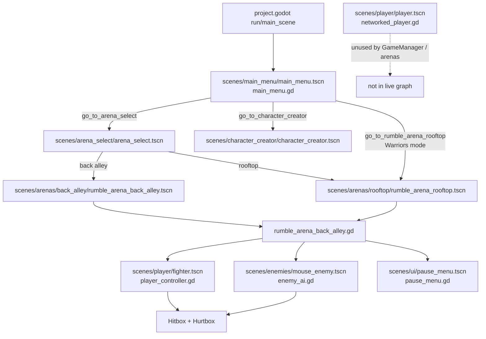
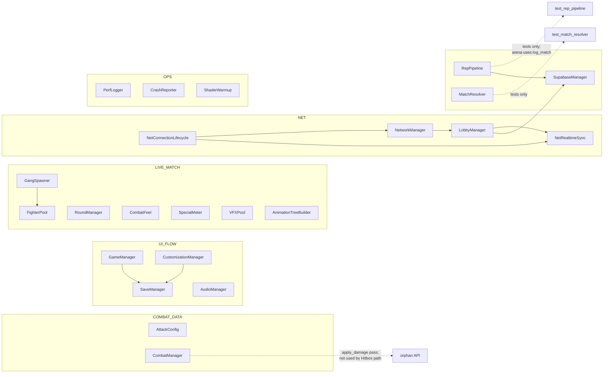
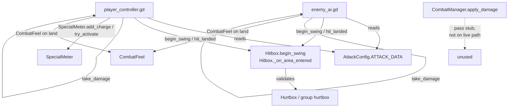
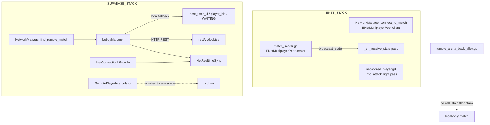
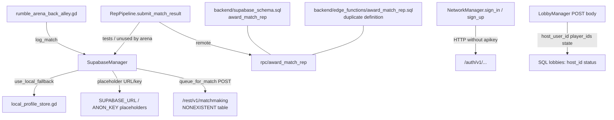

# GUTTERUMBLE — Repository Forensic Audit

**Status:** AUTHORITATIVE for subsequent Commands 01–16  
**Source inspected:** 2026-08-13 on branch after Cursor Gate protocol removal (`main` merge of `cursor/remove-gate-protocol-3c96`)  
**CI:** Gate CI removed; only `.github/workflows/godot-ci.yml` remains  
**Headless Godot in this agent VM:** UNVERIFIED (Godot binary not present; rely on CI / parent agent for runtime confirmation)

Every important conclusion cites an actual file path and symbol.

---

## 1. Actual architecture

GUTTERUMBLE is a Godot 4.7 Mobile landscape brawler. Boot entry is `project.godot` → `[application].run/main_scene` = `res://scenes/main_menu/main_menu.tscn`, with `config/features=PackedStringArray("4.7", "Mobile")`, `window/handheld/orientation="landscape"`, and `renderer/rendering_method="mobile"`. There is **no** `[android]` section in `project.godot`.

**Input map (keyboard only)** in `project.godot` `[input]`:

| Action | Physical key |
|--------|----------------|
| `attack_light` | Z (`physical_keycode` 90) |
| `attack_heavy` | X (`physical_keycode` 88) |
| `dodge` | Space (`physical_keycode` 32) |
| `special_attack` | C (`physical_keycode` 67) |

**23 autoloads** registered under `project.godot` `[autoload]`: `GameManager`, `CustomizationManager`, `NetworkManager`, `SupabaseManager`, `NetRealtimeSync`, `NetConnectionLifecycle`, `LobbyManager`, `AttackConfig`, `CombatManager`, `FighterPool`, `PerfLogger`, `GangSpawner`, `CombatFeel`, `AudioManager`, `RoundManager`, `SaveManager`, `VFXPool`, `AnimationTreeBuilder`, `SpecialMeter`, `CrashReporter`, `MatchResolver`, `RepPipeline`, `ShaderWarmup`.

**Canonical live match path (what actually runs a fight):**

1. `scenes/main_menu/main_menu.gd` → `GameManager.go_to_arena_select()` / `go_to_rumble_arena_rooftop()` / `go_to_character_creator()`
2. Arena select / Warriors route → `scenes/arenas/back_alley/rumble_arena_back_alley.gd` (also the script on `scenes/arenas/rooftop/rumble_arena_rooftop.tscn`)
3. Player: `scenes/player/fighter.tscn` + `scenes/player/player_controller.gd`
4. Enemy: `scenes/enemies/mouse_enemy.tscn` + `scenes/enemies/enemy_ai.gd`
5. Damage registration: `scenes/combat/hitbox.gd` (`Hitbox`) ↔ `scenes/combat/hurtbox.gd` (`Hurtbox`)
6. Frame data: `scenes/player/attack_config.gd` (`AttackConfig`)
7. Match orchestration autoloads: `RoundManager`, `GangSpawner`, `CombatFeel`, `SpecialMeter`, `FighterPool`
8. Result write on match end: `rumble_arena_back_alley.gd` → `SupabaseManager.log_match()` (not `RepPipeline` / `MatchResolver`)

**Parallel / non-live stacks:** ENet (`autoloads/network_manager.gd` `connect_to_match()`, `backend/match_server.gd`) and Supabase Realtime (`net/realtime_sync.gd` `NetRealtimeSync`) exist as autoloads/scripts but are **not** invoked from the live arena loop. Local lobby fallback fabricates lobbies with `host_user_id` / `player_ids` / `state=WAITING` in `net/lobby_manager.gd`, which does not match SQL `lobbies.host_id` / `status` in `backend/supabase_schema.sql`.

---

## 2. Scene dependency graph

**Citations:** `GameManager` scene constants in `autoloads/game_manager.gd` (`MAIN_MENU_SCENE`, `ARENA_SELECT_SCENE`, `RUMBLE_ARENA_BACK_ALLEY_SCENE`, `RUMBLE_ARENA_ROOFTOP_SCENE`, `CHARACTER_CREATOR_SCENE`); arena preload constants `PLAYER_SCENE` / `ENEMY_SCENE` / `PAUSE_SCENE` in `rumble_arena_back_alley.gd`; rooftop ExtResource script path to `rumble_arena_back_alley.gd`.

---

## 3. Autoload dependency graph

**Live match consumers:** `rumble_arena_back_alley.gd` calls `FighterPool.preload_scene` / `pull` / `push` / `return_all`, `GangSpawner.configure` / `spawn_player` / `spawn_wave` / `return_all`, `RoundManager.reset` / `start_round` / `record_win`, `SpecialMeter.reset`, `CombatFeel.finisher_slowmo`, `SupabaseManager.log_match`.

**Test-only consumers of otherwise-global systems:** `scenes/test/test_match_resolver.gd` → `MatchResolver.evaluate`; `scenes/test/test_rep_pipeline.gd` → `RepPipeline.submit_match_result`; `scenes/test/test_match_start.gd` → `MatchStart` (`net/match_start.gd`, not an autoload).

---

## 4. Combat dependency graph

**Live damage path:** `player_controller._on_hitbox_hit_landed` / `enemy_ai._on_hitbox_hit_landed` → target `take_damage(amount, attack_id)` → stagger / KO via `AttackConfig.get_stagger_secs_for_hit`. Specials: `player_controller._try_activate_special` → `SpecialMeter.try_activate` → `_do_special_aoe` (direct shape query, not `Hitbox`).

**Stub:** `CombatManager.apply_damage` in `scenes/combat/combat_manager.gd` is `pass`. Live fighters never call it; they mutate health on the target node itself.

---

## 5. Networking dependency graph

**Facts:**

- ENet client: `NetworkManager.connect_to_match` / `disconnect_from_match`.
- ENet server: `backend/match_server.gd` `start_server`, `player_action`, `player_attack`, `_on_receive_state` (`pass`).
- Realtime: `NetRealtimeSync.subscribe_match_channel` used from `LobbyManager` / `NetConnectionLifecycle`, not from the arena.
- `scenes/player/player.tscn` packs `networked_player.gd` and is never referenced by `GameManager` or arena preloads.
- `MatchStart` (`net/match_start.gd`) countdown/RPC helpers are only exercised by `scenes/test/test_match_start.tscn`.

**Neither stack is in the live match loop.** Arena play is local AI vs player.

---

## 6. Backend dependency graph

**Citations:**

- Dual `award_match_rep`: `backend/supabase_schema.sql` `public.award_match_rep` and `backend/edge_functions/award_match_rep.sql` `public.award_match_rep` (both `GRANT … TO service_role`).
- Phantom matchmaking: `SupabaseManager.queue_for_match` POSTs to `SUPABASE_URL + "/rest/v1/matchmaking"` — no `matchmaking` table in `supabase_schema.sql`.
- Appearance contract split: `SupabaseManager.update_character(char_id, appearance: Array)` vs `SaveManager.save_appearance` / `load_appearance` Dictionary vs schema `characters.appearance JSONB DEFAULT '[]'::jsonb`.
- Client credentials: `SupabaseManager.API_HEADERS` uses anon `apikey` placeholder only — **no `service_role` in client** (good).
- Auth gap: `NetworkManager.sign_in` / `sign_up` request headers are only `Content-Type: application/json` — missing Supabase `apikey`.

---

## 7. Android / export architecture

| Check | Result | Citation |
|-------|--------|----------|
| `export_presets.cfg` | Missing at repo root | filesystem |
| `android/` project dir | Missing | filesystem |
| `[android]` in `project.godot` | Absent | `project.godot` |
| Touch / virtual stick actions | None in `[input]`; no `InputEventScreenTouch` handlers in arena/player scripts | `project.godot`, player/arena `.gd` |
| Orientation | landscape | `window/handheld/orientation` |
| Renderer | mobile + ETC2/ASTC | `[rendering]` |
| Pause UI | Instantiated; keyboard `ui_cancel` only; Resume/Quit **buttons unwired** | `pause_menu.gd` `_unhandled_input`; `pause_menu.tscn` `ResumeButton` / `QuitButton` have no `pressed` connections and `_ready` does not `connect` them |
| Compliance doc | Checklist exists, not executable export | `docs/compliance/ANDROID_EXPORT.md` |

Android is a **documentation aspiration**, not an exportable build in-tree.

---

## 8. Current implemented features

- Main menu with Rumble / Gang Wars / Customize / Quit (`main_menu.gd`).
- Arena select for 1v1 (`arena_select.gd` / `GameManager.go_to_arena_select`).
- Shared arena match manager for back alley + rooftop (`rumble_arena_back_alley.gd`).
- Full local fighter FSM: light combo, heavy, dodge, hit-react, KO (`player_controller.gd`).
- Parallel AI FSM with shared public damage API (`enemy_ai.gd`).
- Hitbox/Hurtbox Area3D registration with per-swing dedup (`Hitbox._hit_this_swing`).
- Attack frame data table (`AttackConfig.ATTACK_DATA`).
- Special meter + Musou-style AOE (`SpecialMeter`, `player_controller._do_special_aoe`).
- Round pip tracking (`RoundManager`).
- Warriors waves via `GangSpawner` + `FighterPool`.
- Combat feel: hit-stop, shake, finisher slow-mo (`CombatFeel`).
- Local appearance save/load + creator apply (`SaveManager`, `CustomizationManager.apply_to_fighter`, `character_creator.gd`).
- Local backend fallback when credentials are placeholders (`SupabaseManager.use_local_fallback` → `LocalProfileStore`).
- Audio + VFX pools (`AudioManager`, `VFXPool`, `attack_trail.gd`).
- Headless CI import + 8 test scenes (`.github/workflows/godot-ci.yml`).

---

## 9. Partially implemented features

| Feature | What works | What does not | Symbols |
|---------|------------|---------------|---------|
| Networking auth | Sign-in/up HTTP scaffolding | Missing `apikey`; placeholder project URL | `NetworkManager.sign_in`, `SUPABASE_URL` |
| Lobby / matchmaking | Local fake lobbies; REST POST shape | Schema mismatch; no live arena join | `LobbyManager._find_local_match`, `find_rumble_match` |
| Realtime sync | WebSocket subscribe helpers | Not driven by arena; interpolator unwired | `NetRealtimeSync.subscribe_match_channel` |
| Match server | ENet listen + RPC signatures | `player_attack` no resolution; `_on_receive_state` `pass` | `match_server.gd` |
| Networked fighter | Authority-gated move + health RPC | `_rpc_attack_light` `pass`; scene unused | `networked_player.gd` |
| Rep / resolve | Autoloads + unit tests | Arena ignores them; uses `log_match` | `RepPipeline`, `MatchResolver`, `rumble_arena_back_alley.gd` |
| Match start countdown | Class + RPCs | Only `test_match_start` | `MatchStart` |
| Pause menu | ESC toggle works | On-screen buttons unwired | `pause_menu.gd` / `.tscn` |
| LOD / materials | Scripts exist | Never attached to live scenes | `fighter_lod.gd`, `material_manager.gd` |
| Android | Mobile renderer + landscape | No presets, no touch, no `android/` | `project.godot` |

---

## 10. Stub / incomplete features

| Symbol | File | Behavior |
|--------|------|----------|
| `CombatManager.apply_damage` | `scenes/combat/combat_manager.gd` | `pass` |
| `networked_player._rpc_attack_light` | `scenes/player/networked_player.gd` | `pass` (comment: wire to `_try_start_attack`) |
| `match_server._on_receive_state` | `backend/match_server.gd` | `pass` |
| `match_server.player_attack` | `backend/match_server.gd` | Looks up peers then returns with no damage apply |
| `match_server.player_action` | `backend/match_server.gd` | Validates peer id only |
| `SupabaseManager.queue_for_match` (remote) | `backend/supabase_manager.gd` | POST to nonexistent `/matchmaking` |
| `SupabaseManager.log_match` (remote branch) | `backend/supabase_manager.gd` | No-op when not in local fallback (falls through after local check) |
| `RemotePlayerInterpolator` | `net/remote_player_interpolator.gd` | Implemented but unwired |
| `fighter_lod.gd` | `scenes/player/fighter_lod.gd` | Unwired; expects `Visuals/High|Med|Low` |
| `material_manager.gd` | `scenes/arenas/back_alley/material_manager.gd` | Unwired to arena scenes |
| `player.tscn` | `scenes/player/player.tscn` | Unused orphan scene |

---

## 11. Broken contracts

1. **Lobby JSON vs SQL:** client writes `host_user_id`, `player_ids`, `state` (`LobbyManager`); schema expects `host_id`, `status IN ('open','starting','closed')`, members in `lobby_members` (`supabase_schema.sql`).
2. **Appearance type:** Dictionary in save/creator path; `Array` in `SupabaseManager.update_character` / `LocalProfileStore.update_character`; JSONB default `[]` in SQL.
3. **Dual `award_match_rep` definitions** in schema vs edge_functions SQL — drift risk on deploy.
4. **Rep path duality:** tests use `RepPipeline.submit_match_result` → `award_match_rep`; live arena uses `SupabaseManager.log_match` only.
5. **Auth headers:** Supabase Auth endpoints called without `apikey` (`NetworkManager.sign_in` / `sign_up`).
6. **Matchmaking endpoint:** `/rest/v1/matchmaking` has no table/RPC in schema.
7. **CombatManager vs Hitbox:** autoload suggests central damage; live contract is peer-to-peer `take_damage` on controllers.
8. **Pause buttons:** UI nodes exist without signal wiring — contract with players expecting tap targets fails on touch devices even before touch input exists.

---

## 12. Security risks

| Risk | Severity | Citation |
|------|----------|----------|
| Placeholder anon key / URL committed | High for production misconfig | `SupabaseManager.SUPABASE_URL`, `SUPABASE_ANON_KEY`, `API_HEADERS` |
| Auth requests without `apikey` | High — Auth API rejects or misroutes | `NetworkManager.sign_in` / `sign_up` headers |
| `@rpc("any_peer")` on `match_server.player_attack` / `player_action` | High if server ever shipped as-is | `backend/match_server.gd` |
| `@rpc("any_peer", "call_local")` on `_rpc_attack_light` | Medium — any peer can invoke | `networked_player.gd` |
| Client calling `award_match_rep` with anon headers | Medium — function is `service_role`-only; fails closed today, wrong trust model if GRANT changes | `RepPipeline._submit_remote`, SQL `GRANT … TO service_role` |
| **Positive:** no `service_role` key in client tree | Good | Client only references anon placeholders |

---

## 13. Multiplayer authority violations

- `networked_player._rpc_attack_light` is `@rpc("any_peer", "call_local", "reliable")` with empty body — any peer can spam; no server validation of hit results.
- `match_server.player_attack` is `@rpc("any_peer")` with no authority check beyond dictionary membership; does not apply damage or verify reachability.
- `match_server.broadcast_state` → `_on_receive_state` has no authority annotation beyond default `@rpc` and empty body — state channel is non-functional.
- Live arena has **no** `multiplayer.is_server()` gating; all simulation is local authority by omission.
- `MatchStart.begin_countdown_as_server` checks `multiplayer.is_server()` but is unused outside tests — correct pattern exists, not adopted by arena.

---

## 14. Performance risks

- `fighter_lod.gd` unwired — no mesh LOD when wave counts rise (`GangSpawner`).
- `material_manager.gd` unwired — no centralized material swap; risk of runtime material compiles if customization paths create materials mid-match (mitigated partially by `ShaderWarmup` / customization warmup test).
- `CombatFeel` hit-stop / `Engine.time_scale` interactions historically froze games (documented fixed in `PROJECT_STATE.md`); still a footgun for future feel tweaks.
- Mobile light limit `limits/rendering/max_lights_per_object=2` — fine for current arenas; boss/VFX content must respect it.
- Object pooling exists (`FighterPool`, `VFXPool`) and is used by the live arena — keep new spawn paths on these APIs.

---

## 15. Android risks

- Cannot export without creating `export_presets.cfg` and Android templates.
- Keyboard-only `[input]` map — unplayable on device without touch UI.
- Pause `ResumeButton` / `QuitButton` unwired — even a future touch layer cannot click-to-resume without script connections; only `ui_cancel` works.
- No `[android]` permissions / package metadata in `project.godot`.
- Landscape-only assumption must be validated on foldables / multi-window (not tested; UNVERIFIED headless).

---

## 16. Database inconsistencies

| Topic | Client / local | SQL schema |
|-------|----------------|------------|
| Lobby host field | `host_user_id` | `host_id` |
| Lobby lifecycle | `state` = `WAITING` / string enum in GDScript | `status` = `open` / `starting` / `closed` |
| Lobby membership | embedded `player_ids` array | `lobby_members` junction table |
| Appearance | Dictionary (save) / Array (SupabaseManager API) | `JSONB DEFAULT '[]'` |
| Matchmaking | POST `/matchmaking` | **no table** |
| Rep award | `RepPipeline` RPC body `p_*` params | two SQL definitions of `award_match_rep` |
| Match logging | `log_match` local JSON / remote no-op | `matches` + `match_results` tables unused by arena path |

---

## 17. Testing gaps

**CI covered (8 headless scenes in `godot-ci.yml`):**

1. `test_spawn_validator.tscn`
2. `test_hit_registration.tscn`
3. `test_customization_warmup.tscn`
4. `test_match_resolver.tscn`
5. `test_match_start.tscn`
6. `test_rep_pipeline.tscn`
7. `test_shader_warmup.tscn`
8. `test_crash_reporter.tscn`

**Gaps:**

- No headless test boots `rumble_arena_back_alley.tscn` / rooftop full match.
- No test asserts pause button signal wiring.
- No test for lobby field parity vs `supabase_schema.sql`.
- No test that arena calls `RepPipeline` (it does not — coverage of RepPipeline does not protect live logging).
- No Android instrumentation / export dry-run in CI.
- No multiplayer peer integration test (ENet or Realtime).
- Agent VM Godot headless: **UNVERIFIED** (binary missing here).

---

## 18. Asset / animation gaps

- Combat clips still largely placeholder / retarget pending (`Universal Animation Library[Standard]/`, `assets/characters/mouse/QUATERNIUS_RETARGET_SETUP.md`).
- `fighter_lod.gd` requires authored High/Med/Low meshes under `Visuals` — only one quality level exists.
- `docs/weapon_manifest.json` / weapon props exist as manifests; no live weapon equip in `player_controller.gd`.
- Remaining arenas listed in docs (`BUILD_GUIDE.md`) — only back alley + rooftop scenes present under `scenes/arenas/`.
- Asset provenance for `mouse.glb` / arena textures still an open release item (`CREDITS.md` / `PROJECT_STATE.md`).

---

## 19. Exact files requiring modification

Prioritized for Commands 01–16 (docs-only this command; gameplay files listed as **targets**, not modified here):

**Canonicalize / orphans**

- `scenes/combat/combat_manager.gd` — implement or delete `apply_damage`
- `scenes/player/networked_player.gd` — implement `_rpc_attack_light` or isolate
- `scenes/player/player.tscn` — wire or remove
- `backend/match_server.gd` — implement `_on_receive_state` / attack resolution
- `net/remote_player_interpolator.gd` — attach from networked fighter scenes
- `scenes/player/fighter_lod.gd` — wire after assets
- `scenes/arenas/back_alley/material_manager.gd` — wire or archive
- `net/match_start.gd` — integrate into match flow
- `systems/match_resolver.gd` / `systems/rep_pipeline.gd` — call from arena or demote from “live” docs

**Android offline**

- `project.godot` — touch actions; eventual `[android]` / export metadata
- new `export_presets.cfg`
- `scenes/ui/pause_menu.gd` + `.tscn` — connect Resume/Quit
- new touch HUD scene + player input routing in `player_controller.gd`

**Backend schema**

- `backend/supabase_schema.sql`
- `backend/edge_functions/award_match_rep.sql` — single definition
- `net/lobby_manager.gd` — field names
- `backend/supabase_manager.gd` — appearance type, `queue_for_match`, remote `log_match`
- `autoloads/network_manager.gd` — auth `apikey`

**Dedicated server / authority / co-op**

- `backend/match_server.gd`
- `autoloads/network_manager.gd`
- `scenes/player/networked_player.gd`
- `net/realtime_sync.gd` / `net/connection_lifecycle.gd`
- `scenes/arenas/back_alley/rumble_arena_back_alley.gd` — optional net entrypoints

**Content / feel / performance** (later gates)

- `autoloads/gang_spawner.gd`, `enemy_ai.gd`, weapon systems (new), boss scenes (new), LOD meshes, additional arena `.tscn` files

**Do not treat as source of truth when they contradict code:** `TRACKING.json`, `PROJECT_STATE.md`, `BUILD_GUIDE.md`, `BUILD_GUIDE_10X.md`, `docs/PUBLIC_RELEASE_ROADMAP.md` (path drift, stub claims, phase status).

---

## 20. Recommended implementation order

Aligns with the revised critical path:

1. **Canonicalize** — freeze live path; mark/remove orphans; make docs match `rumble_arena_back_alley.gd` + fighter/enemy + Hitbox path.
2. **Android offline** — export presets, touch controls, wire pause buttons; ship a single-player APK loop.
3. **Backend schema** — unify lobby fields, appearance type, single `award_match_rep`, fix auth `apikey`, remove phantom `/matchmaking`.
4. **Dedicated server** — make `match_server.gd` a real tick + state broadcast.
5. **Authoritative combat** — server-validated hits; kill `any_peer` attack RPCs; replace `apply_damage` / `_rpc_attack_light` stubs.
6. **2-player co-op** — wire `networked_player` + `RemotePlayerInterpolator` + `MatchStart` into arena boot.
7. **AI / revive / weapons** — deepen `enemy_ai.gd`, add revive contract, implement weapon manifest → combat.
8. **Waves / boss** — extend `GangSpawner` wave tables; add boss encounter scenes.
9. **Matchmaking** — real queue against schema; connect `NetworkManager.find_rumble_match` to server allocation.
10. **Performance** — LOD, pools, Pixel 6a profiling (`PerfLogger`).
11. **Content** — arenas, animations retarget, audio polish.
12. **Release** — store compliance (`docs/compliance/*`), provenance, closed test.

Detailed gate edges: see `docs/engineering/IMPLEMENTATION_DEPENDENCY_GRAPH.md`.

---

## Authority note

This audit is **AUTHORITATIVE** for subsequent Commands 01–16. Docs (`TRACKING.json`, `PROJECT_STATE.md`, `BUILD_GUIDE.md`, `BUILD_GUIDE_10X.md`, `docs/PUBLIC_RELEASE_ROADMAP.md`) that contradict code are **DRIFT** — prefer this file and the cited symbols over checklist prose.
